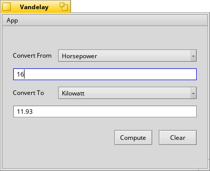

# VanDelay

VanDelay is a simple unit conversion tool that outputs equivalent values for various units of length, weight, capacity, temperature, and power.

Available units:
* Length
    * Foot
    * Kilometer
    * Meter
    * Mile (US)
* Power
    * Horsepower
    * Kilowatt
* Temperature
    * Celsius
    * Fahrenheit
* Capacity
    * Gallon (US)
    * Litre
* Weight
    * Kilogram
    * Pound
